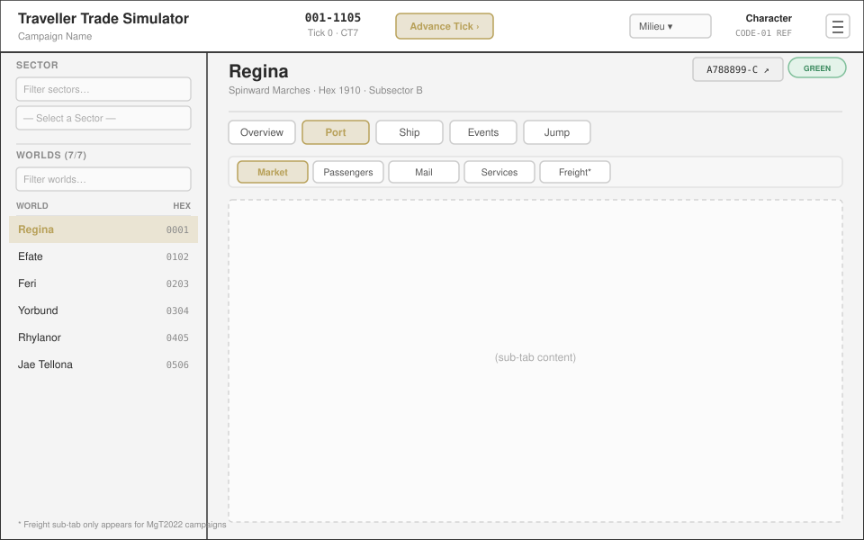
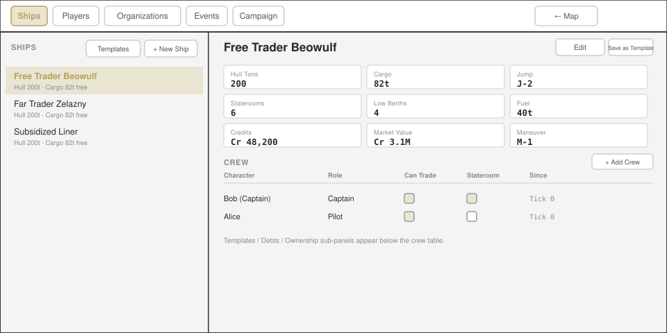

# Detailed Design

**Project:** Traveller Trade Simulator  
**Version:** 0.12.0

---

## 1. Database Schema

The backend is Cloudflare D1 (SQLite), not PostgreSQL/Supabase. UUID primary keys are `TEXT`, generated in Worker code via `crypto.randomUUID()`; timestamps are `TEXT` ISO 8601 strings (`datetime('now')`); booleans are `INTEGER` (0/1). There are no stored functions and no RLS — all business logic and authorization live in the Worker (`worker/src/routes/*.js`, `worker/src/middleware/auth.js`). The consolidated baseline is `d1/schema.sql`; incremental changes are applied via numbered migrations `d1/002_*.sql` through `d1/019_broker_commission_type.sql` (19 migrations total, `001` being the baseline itself), applied by hand via `wrangler d1 execute` (no CI/automated migration runner exists).

**Schema-drift detection:** as of migration `011`, a `schema_migrations` ledger table (`id`, `applied_at`) records every migration a given D1 database has actually received — `d1/schema.sql` seeds it fully caught-up for fresh installs, and every migration file from `011` onward ends with its own `INSERT` recording itself. `worker/src/lib/schema-version.js` holds the Worker's own `EXPECTED_MIGRATIONS` list (must be updated in the same commit as any new migration file) and is checked by `GET /api/health`, which returns `503` with `schema_ok: false` if the live database's ledger doesn't match — the frontend (`src/lib/health-check.js`, called once at startup from `main.js`) shows a blocking "database schema is out of date" screen instead of letting the app continue into confusing mid-action failures.

### 1.1 Tables

#### `campaigns`

| Column | Type | Constraints | Description |
|--------|------|-------------|-------------|
| `id` | TEXT | PK | App-generated UUID |
| `code` | TEXT | NOT NULL, UNIQUE | Shareable campaign identifier |
| `label` | TEXT | NOT NULL | Display name |
| `milieu` | TEXT | NOT NULL, default `'M1105'` | Traveller Map milieu code |
| `trade_rules` | TEXT | NOT NULL, default `'CT7'` | `'CT7'`, `'T5'`, or `'MgT2022'`; locked after creation (no CHECK constraint on this column) |
| `recovery_code_hash` | TEXT | nullable | PBKDF2 hash of the one-time recovery code |
| `created_at` | TEXT | NOT NULL, default `datetime('now')` | |

#### `sessions`
*(originally defined in `d1/002_sessions.sql`; folded into the consolidated `d1/schema.sql` baseline as part of the migration-011 schema-drift-ledger work, closing what had been a documented gap)*

| Column | Type | Constraints | Description |
|--------|------|-------------|-------------|
| `token` | TEXT | PK | Bearer session token, issued on login |
| `player_id` | TEXT | FK → players(id) ON DELETE CASCADE | |
| `campaign_id` | TEXT | FK → campaigns(id) ON DELETE CASCADE | |
| `expires_at` | TEXT | NOT NULL | 30-day TTL |
| `created_at` | TEXT | NOT NULL | |

Index: `idx_sessions_player (player_id)`

#### `campaign_calendar`

| Column | Type | Constraints | Description |
|--------|------|-------------|-------------|
| `campaign_id` | TEXT | PK, FK → campaigns(id) ON DELETE CASCADE | One row per campaign |
| `current_tick` | INTEGER | NOT NULL, default 0 | Ticks elapsed since campaign start (1 tick = 1 jump-week) |
| `year` | INTEGER | NOT NULL, default 1105 | Imperial year — `1105 + tick / 48` |
| `day` | INTEGER | NOT NULL, default 1 | Day of year 1–337 — `(tick % 48) * 7 + 1` |
| `updated_at` | TEXT | NOT NULL | |

#### `players`

| Column | Type | Constraints | Description |
|--------|------|-------------|-------------|
| `id` | TEXT | PK | |
| `campaign_id` | TEXT | FK → campaigns(id) ON DELETE CASCADE | |
| `character_name` | TEXT | NOT NULL | Unique within campaign |
| `pin_hash` | TEXT | NOT NULL | `pbkdf2:<iterations>:<saltHex>:<hashHex>` (Web Crypto API) |
| `role` | TEXT | NOT NULL, default `'player'` | `'player'` or `'referee'` |
| `credits` | INTEGER | NOT NULL, default 0 | **Currently dead** — always 0, never read or written by any transaction logic; every real credit movement is on `ships.credits`. Earmarked as the field to repurpose for a future personal-wallet feature, not yet built |
| `failed_attempts` | INTEGER | NOT NULL, default 0 | PIN failure counter |
| `locked_until` | TEXT | nullable | Lockout expiry; null = not locked |
| `last_seen` | TEXT | nullable | |
| `created_at` | TEXT | NOT NULL | |
| `strength` | INTEGER | nullable | MgT2022 characteristic *(`d1/014_mgt2022_character_ship_fields.sql`)* |
| `dexterity` | INTEGER | nullable | MgT2022 characteristic |
| `endurance` | INTEGER | nullable | MgT2022 characteristic |
| `intelligence` | INTEGER | nullable | MgT2022 characteristic |
| `education` | INTEGER | nullable | MgT2022 characteristic |
| `social_standing` | INTEGER | nullable | MgT2022 characteristic; feeds Mail's SOC DM via `characteristicDM()` (wired in Phase 5, HLD §7c) |
| `background` | TEXT | nullable | e.g. `'Scout'`, `'Navy'`, `'Merchant'` — feeds Mail's Naval/Scout rank DM (wired in Phase 5, HLD §7c) |
| `rank` | INTEGER | nullable | Rank within `background` |
| UNIQUE | `(campaign_id, character_name)` | | |

All eight fields added by migration `014`, nullable/defaulted so existing rows are unaffected; a referee fills them in per-character over time via `PATCH /api/referee/players/:id`, mirrored by a player self-service pair (`GET`/`PATCH /api/reports/characteristics`) with the same `session.player_id === player_id` ownership check `/skills` uses. Editable in `CharacterDialog.vue`, gated to campaigns with `trade_rules === 'MgT2022'`.

#### `ships`

| Column | Type | Constraints | Description |
|--------|------|-------------|-------------|
| `id` | TEXT | PK | |
| `campaign_id` | TEXT | FK → campaigns(id) ON DELETE CASCADE | |
| `name` | TEXT | NOT NULL | Unique within campaign |
| `hull_type` | TEXT | nullable | e.g. `'Free Trader'` |
| `hull_tons` | INTEGER | NOT NULL, default 200 | |
| `cargo_capacity` | INTEGER | NOT NULL, default 80 | Hold in tons |
| `current_world` | TEXT | nullable | Hex of current location |
| `current_sector` | TEXT | nullable | |
| `credits` | INTEGER | NOT NULL, default 0 | Ship's operating treasury |
| `jump_rating` | INTEGER | nullable | |
| `maneuver_drive_rating` | INTEGER | nullable | |
| `stateroom_capacity` | INTEGER | NOT NULL, default 0 | High/Middle passenger berths |
| `low_berth_capacity` | INTEGER | NOT NULL, default 0 | Low passage berths |
| `fuel_capacity` | INTEGER | NOT NULL, default 0 | Tons |
| `fuel_current` | INTEGER | NOT NULL, default 0 | Tons |
| `market_value` | INTEGER | NOT NULL, default 0 | Referee-entered valuation, populated via Ship Template selection or manual entry (§Asset Valuation) |
| `armed` | INTEGER | NOT NULL, default 0, CHECK IN (0,1) | MgT2022: ship carries weapons — feeds Mail's armed-ship DM (wired in Phase 5, HLD §7c). Added by `d1/014_mgt2022_character_ship_fields.sql` |
| `created_at` | TEXT | NOT NULL | |
| UNIQUE | `(campaign_id, name)` | | |

Index: `idx_ships_campaign (campaign_id)`

#### `ship_templates`
*(`d1/005_ship_templates.sql`)* — referee-managed catalogue for the New Ship form's dropdown; no persistent link to ships created from one.

| Column | Type | Constraints | Description |
|--------|------|-------------|-------------|
| `id` | TEXT | PK | |
| `campaign_id` | TEXT | FK → campaigns(id) ON DELETE CASCADE | |
| `trade_rules` | TEXT | NOT NULL, CHECK IN ('CT7','T5','MgT2022') | Ruleset this template's stats are tagged for |
| `name` | TEXT | NOT NULL | |
| `hull_type` | TEXT | nullable | |
| `hull_tons` | INTEGER | NOT NULL, default 200 | |
| `cargo_capacity` | INTEGER | NOT NULL, default 80 | |
| `jump_rating` | INTEGER | nullable | |
| `maneuver_drive_rating` | INTEGER | nullable | |
| `stateroom_capacity` | INTEGER | NOT NULL, default 0 | |
| `low_berth_capacity` | INTEGER | NOT NULL, default 0 | |
| `fuel_capacity` | INTEGER | NOT NULL, default 0 | |
| `market_value` | INTEGER | NOT NULL, default 0 | |
| `armed` | INTEGER | NOT NULL, default 0, CHECK IN (0,1) | Mirrors `ships.armed`; carried onto ships created from this template. Added by `d1/014_mgt2022_character_ship_fields.sql` |
| `notes` | TEXT | nullable | Flags the lazily-seeded CT7/MgT2022 starter template as unverified |
| `created_at` | TEXT | NOT NULL | |
| UNIQUE | `(campaign_id, name)` | | |

Index: `idx_ship_templates_campaign (campaign_id, trade_rules)`

#### `ship_debts`
*(`d1/006_ship_debts.sql`)* — no interest; Referee adjusts `current_balance` directly.

| Column | Type | Constraints | Description |
|--------|------|-------------|-------------|
| `id` | TEXT | PK | |
| `campaign_id` | TEXT | FK → campaigns(id) ON DELETE CASCADE | |
| `ship_id` | TEXT | FK → ships(id) ON DELETE CASCADE, nullable | Nullable so a future corporate/fleet-level debt can reuse this table without a new one |
| `type` | TEXT | NOT NULL, CHECK IN ('mortgage','loan','obligation') | |
| `creditor_name` | TEXT | nullable | |
| `principal` | INTEGER | NOT NULL | |
| `current_balance` | INTEGER | NOT NULL | |
| `due_tick` | INTEGER | nullable | |
| `notes` | TEXT | nullable | |
| `created_at` | TEXT | NOT NULL | |

Index: `idx_ship_debts_ship (campaign_id, ship_id)`

#### `debt_payments`
*(`d1/006_ship_debts.sql`)* — separate from `transactions` because that table's `type` `CHECK` constraint can't be `ALTER`ed in place in SQLite.

| Column | Type | Constraints | Description |
|--------|------|-------------|-------------|
| `id` | TEXT | PK | |
| `debt_id` | TEXT | FK → ship_debts(id) ON DELETE CASCADE | |
| `campaign_id` | TEXT | FK → campaigns(id) ON DELETE CASCADE | |
| `ship_id` | TEXT | FK → ships(id) ON DELETE SET NULL, nullable | |
| `tick` | INTEGER | NOT NULL | |
| `amount` | INTEGER | NOT NULL | |
| `notes` | TEXT | nullable | |
| `created_at` | TEXT | NOT NULL | |

Index: `idx_debt_payments_debt (debt_id, tick DESC)`

#### `ship_ownership`
*(`d1/007_ownership.sql`)* — multiple players jointly owning one ship (a partnership); independent of Organizations below. Referee-managed only — closer to a debt/contract the referee arbitrates than a business a player runs.

| Column | Type | Constraints | Description |
|--------|------|-------------|-------------|
| `id` | TEXT | PK | |
| `campaign_id` | TEXT | FK → campaigns(id) ON DELETE CASCADE | |
| `ship_id` | TEXT | FK → ships(id) ON DELETE CASCADE | |
| `player_id` | TEXT | FK → players(id) ON DELETE CASCADE | |
| `percentage` | INTEGER | NOT NULL, CHECK (0 < percentage ≤ 100) | Server-validated so a ship's shares never sum past 100% |
| `created_at` | TEXT | NOT NULL | |
| UNIQUE | `(ship_id, player_id)` | | |

Index: `idx_ship_ownership_ship (ship_id)`

#### `organizations`
*(`d1/007_ownership.sql`, extended `d1/009_org_financials.sql`)* — the generic Organization entity; corporation, confederation, and trade union are all this, differentiated only by configuration.

| Column | Type | Constraints | Description |
|--------|------|-------------|-------------|
| `id` | TEXT | PK | |
| `campaign_id` | TEXT | FK → campaigns(id) ON DELETE CASCADE | |
| `name` | TEXT | NOT NULL | |
| `treasury_credits` | INTEGER | NOT NULL, default 0 | |
| `dues_rate` | INTEGER | nullable | Flat rate charged per member ship per collection; null/0 = no dues |
| `dues_frequency_ticks` | INTEGER | NOT NULL, default 4 | Collection interval — drives a "due" indicator only, never automatic collection |
| `last_dues_tick` | INTEGER | nullable | Tick of last collection; null = never collected (first collection is always allowed regardless of frequency) |
| `notes` | TEXT | nullable | |
| `created_at` | TEXT | NOT NULL | |
| UNIQUE | `(campaign_id, name)` | | |

#### `organization_members`
*(`d1/007_ownership.sql`)* — a ship's affiliation with an org.

| Column | Type | Constraints | Description |
|--------|------|-------------|-------------|
| `id` | TEXT | PK | |
| `organization_id` | TEXT | FK → organizations(id) ON DELETE CASCADE | |
| `ship_id` | TEXT | FK → ships(id) ON DELETE CASCADE | |
| `owns_ship` | INTEGER | NOT NULL, default 0 | 1 = org owns this ship's assets/debts outright (corporation/fleet); 0 = ship stays independently owned, just dues/reporting-affiliated (confederation) |
| `created_at` | TEXT | NOT NULL | |
| UNIQUE | `(organization_id, ship_id)` | | |

Indexes: `idx_org_members_org (organization_id)`, `idx_org_members_ship (ship_id)`, `idx_org_members_single_owner (ship_id) WHERE owns_ship = 1` (**UNIQUE** — a ship can be owned outright by at most one organization at a time; enforced here at the DB level plus an app-level `409` check in the Worker for a friendly error message)

#### `organization_officers`
*(`d1/008_org_officers.sql`)* — players authorized to manage an organization. Flat list, no role hierarchy: any officer can manage the org fully, including adding/removing other officers. Referees always retain override rights regardless of officer status.

| Column | Type | Constraints | Description |
|--------|------|-------------|-------------|
| `id` | TEXT | PK | |
| `organization_id` | TEXT | FK → organizations(id) ON DELETE CASCADE | |
| `player_id` | TEXT | FK → players(id) ON DELETE CASCADE | |
| `created_at` | TEXT | NOT NULL | |
| UNIQUE | `(organization_id, player_id)` | | |

Index: `idx_org_officers_org (organization_id)`

#### `organization_ownership`
*(`d1/009_org_financials.sql`)* — player equity in an org that owns ships outright. Mirrors `ship_ownership`'s 100%-ceiling validation exactly, but is **officer-manageable**, not referee-only — officers run the business day-to-day, equity included.

| Column | Type | Constraints | Description |
|--------|------|-------------|-------------|
| `id` | TEXT | PK | |
| `campaign_id` | TEXT | FK → campaigns(id) ON DELETE CASCADE | |
| `organization_id` | TEXT | FK → organizations(id) ON DELETE CASCADE | |
| `player_id` | TEXT | FK → players(id) ON DELETE CASCADE | |
| `percentage` | INTEGER | NOT NULL, CHECK (0 < percentage ≤ 100) | |
| `created_at` | TEXT | NOT NULL | |
| UNIQUE | `(organization_id, player_id)` | | |

Index: `idx_org_ownership_org (organization_id)`

#### `dues_payments`
*(`d1/009_org_financials.sql`)* — audit trail, one row per ship per collection event.

| Column | Type | Constraints | Description |
|--------|------|-------------|-------------|
| `id` | TEXT | PK | |
| `organization_id` | TEXT | FK → organizations(id) ON DELETE CASCADE | |
| `ship_id` | TEXT | FK → ships(id) ON DELETE CASCADE | |
| `campaign_id` | TEXT | FK → campaigns(id) ON DELETE CASCADE | |
| `tick` | INTEGER | NOT NULL | |
| `amount` | INTEGER | NOT NULL | |
| `created_at` | TEXT | NOT NULL | |

Index: `idx_dues_payments_org (organization_id, tick DESC)`

#### `disbursements`
*(`d1/009_org_financials.sql`)* — ad hoc org-treasury → member-ship transfers, officer-triggered.

| Column | Type | Constraints | Description |
|--------|------|-------------|-------------|
| `id` | TEXT | PK | |
| `organization_id` | TEXT | FK → organizations(id) ON DELETE CASCADE | |
| `ship_id` | TEXT | FK → ships(id) ON DELETE CASCADE | |
| `campaign_id` | TEXT | FK → campaigns(id) ON DELETE CASCADE | |
| `tick` | INTEGER | NOT NULL | |
| `amount` | INTEGER | NOT NULL | |
| `notes` | TEXT | nullable | |
| `created_at` | TEXT | NOT NULL | |

Index: `idx_disbursements_org (organization_id, tick DESC)`

#### `crew`

| Column | Type | Constraints | Description |
|--------|------|-------------|-------------|
| `id` | TEXT | PK | |
| `campaign_id` | TEXT | FK → campaigns(id) ON DELETE CASCADE | |
| `ship_id` | TEXT | FK → ships(id) ON DELETE CASCADE | |
| `player_id` | TEXT | FK → players(id) ON DELETE CASCADE | |
| `role` | TEXT | NOT NULL, default `'crew'` | Free-form: captain, pilot, engineer, etc. |
| `can_trade` | INTEGER | NOT NULL, default 0 | Trading authorization |
| `has_stateroom` | INTEGER | NOT NULL, default 1 | 0 = double-bunked, frees a stateroom for a paying passenger |
| `joined_tick` | INTEGER | NOT NULL, default 0 | |
| `left_tick` | INTEGER | nullable | null = currently aboard |
| UNIQUE | `(ship_id, player_id, joined_tick)` | | |

Indexes: `idx_crew_player (campaign_id, player_id, left_tick)`, `idx_crew_ship (campaign_id, ship_id)`

#### `player_skills`

| Column | Type | Constraints | Description |
|--------|------|-------------|-------------|
| `id` | TEXT | PK | |
| `campaign_id` | TEXT | FK → campaigns(id) ON DELETE CASCADE | |
| `player_id` | TEXT | FK → players(id) ON DELETE CASCADE | |
| `skill` | TEXT | NOT NULL | Free-form, e.g. `'Broker'` |
| `level` | INTEGER | NOT NULL, default 0, CHECK (level ≥ 0) | |
| `created_at` | TEXT | NOT NULL | |
| UNIQUE | `(player_id, skill)` | | |

Index: `idx_player_skills_player (campaign_id, player_id)`

#### `market_snapshots`
*(`is_black_market` added by `d1/018_black_market.sql`, via the safer create-new-table/copy-rows/rename pattern — this table holds real price history read by charts, unlike `traffic_snapshots` below, so a destructive drop was off the table.)*

| Column | Type | Constraints | Description |
|--------|------|-------------|-------------|
| `id` | TEXT | PK | |
| `campaign_id` | TEXT | FK → campaigns(id) ON DELETE CASCADE | |
| `world_hex` | TEXT | NOT NULL | 4-digit hex code |
| `sector` | TEXT | NOT NULL | |
| `trade_good_die` | TEXT | NOT NULL | d66 die code, e.g. `'11'` |
| `trade_good_name` | TEXT | NOT NULL | |
| `tick` | INTEGER | NOT NULL | |
| `purchase_price` | INTEGER | NOT NULL | Cr/ton |
| `sale_price` | INTEGER | NOT NULL | Cr/ton |
| `qty_available` | INTEGER | NOT NULL | Tons |
| `source_codes` | TEXT | NOT NULL, default `''` | Space-separated trade codes applied |
| `is_black_market` | INTEGER | NOT NULL, default 0, CHECK IN (0,1) | MgT2022-only. A second, parallel row set per (world, tick) generated via `mgt2022Composition(..., seekingBlackMarket: true)` — same world/tick grain as the normal listing, not a new dimension; gated on `black_market_search_attempts` (below), same shape as Find a Supplier gating visibility into the normal listing |
| `created_at` | TEXT | NOT NULL | |
| UNIQUE | `(campaign_id, world_hex, sector, trade_good_die, tick, is_black_market)` | | |

Index: `idx_snapshots_world (campaign_id, world_hex, sector, tick DESC)`

#### `market_monthly`

| Column | Type | Constraints | Description |
|--------|------|-------------|-------------|
| `id` | TEXT | PK | |
| `campaign_id` | TEXT | FK | |
| `world_hex` | TEXT | NOT NULL | |
| `sector` | TEXT | NOT NULL | |
| `trade_good_die` | TEXT | NOT NULL | |
| `year` | INTEGER | NOT NULL | |
| `month` | INTEGER | NOT NULL | 1–12 |
| `open_price` / `high_price` / `low_price` / `close_price` | INTEGER | NOT NULL | |
| `volume_tons` | INTEGER | NOT NULL, default 0 | |
| `created_at` | TEXT | NOT NULL | |
| UNIQUE | `(campaign_id, world_hex, sector, trade_good_die, year, month)` | | |

Index: `idx_monthly_world (campaign_id, world_hex, sector, trade_good_die, year, month)`

#### `market_annual`
Same structure as `market_monthly` but no `month` column; `UNIQUE (campaign_id, world_hex, sector, trade_good_die, year)`.

#### `market_events`

| Column | Type | Constraints | Description |
|--------|------|-------------|-------------|
| `id` | TEXT | PK | |
| `campaign_id` | TEXT | FK | |
| `tick` | INTEGER | NOT NULL | Tick the event fired |
| `scope` | TEXT | NOT NULL, CHECK IN ('local','subsector') | |
| `world_hex` | TEXT | nullable | null = subsector-wide |
| `sector` | TEXT | nullable | |
| `trade_good_die` | TEXT | nullable | null = affects all goods |
| `buy_modifier_pct` / `sell_modifier_pct` | INTEGER | nullable | |
| `description` | TEXT | NOT NULL | |
| `expires_tick` | INTEGER | nullable | null = permanent |
| `severity` | TEXT | NOT NULL, default `'minor'`, CHECK IN ('minor','major','crisis') | |
| `created_at` | TEXT | NOT NULL | |

Index: `idx_events_world (campaign_id, world_hex, sector, tick DESC)`

#### `cargo`

| Column | Type | Constraints | Description |
|--------|------|-------------|-------------|
| `id` | TEXT | PK | |
| `campaign_id` | TEXT | FK | |
| `player_id` | TEXT | FK → players(id) ON DELETE CASCADE | Owner |
| `ship_id` | TEXT | FK → ships(id) ON DELETE SET NULL, nullable | Aboard which ship |
| `trade_good_die` | TEXT | NOT NULL | |
| `trade_good_name` | TEXT | NOT NULL | |
| `tons` | INTEGER | NOT NULL, CHECK (tons > 0) | |
| `purchase_price` | INTEGER | NOT NULL | Cr/ton paid |
| `purchased_tick` | INTEGER | NOT NULL | |
| `purchase_world` | TEXT | NOT NULL | Hex of source world |
| `purchase_sector` | TEXT | NOT NULL | |
| `purchase_world_name` | TEXT | NOT NULL, default `''` | |
| `created_at` | TEXT | NOT NULL | |

Indexes: `idx_cargo_player (campaign_id, player_id)`, `idx_cargo_ship (campaign_id, ship_id)`

#### `transactions`

| Column | Type | Constraints | Description |
|--------|------|-------------|-------------|
| `id` | TEXT | PK | |
| `campaign_id` | TEXT | FK | |
| `player_id` | TEXT | FK → players(id) ON DELETE CASCADE | |
| `ship_id` | TEXT | FK → ships(id) ON DELETE SET NULL, nullable | |
| `tick` | INTEGER | NOT NULL | |
| `type` | TEXT | NOT NULL, CHECK IN (`buy`,`sell`,`fee`,`event`,`fuel`,`passenger_fare`,`passenger_refund`,`mail`,`freight_charge`,`freight_refund`,`freight_penalty`,`broker_commission`) | This `CHECK` can't be `ALTER`ed in place — why `debt_payments`/`dues_payments`/`disbursements` are separate tables rather than new `type` values (the three `freight_*` values were added via a table-rebuild migration, `d1/010_mgt2022_trade_rules.sql`; `broker_commission` likewise via `d1/019_broker_commission_type.sql`, both copy-and-rename since a straight `ALTER` isn't possible in SQLite either) |
| `trade_good_die` / `trade_good_name` / `tons` / `price_per_ton` | — | nullable | |
| `total_cr` | INTEGER | NOT NULL | Positive = income, negative = expense |
| `world_hex` / `sector` / `notes` | TEXT | nullable | |
| `created_at` | TEXT | NOT NULL | |

Indexes: `idx_txn_player (campaign_id, player_id, tick DESC)`, `idx_txn_ship (campaign_id, ship_id, tick DESC)`

#### `trade_records`
Records a completed buy+sell round trip; feeds the `realized_ohlcv` view below.

| Column | Type | Constraints | Description |
|--------|------|-------------|-------------|
| `id` | TEXT | PK | |
| `campaign_id` | TEXT | FK | |
| `player_id` | TEXT | FK → players(id) ON DELETE CASCADE | |
| `ship_id` | TEXT | FK → ships(id) ON DELETE SET NULL, nullable | |
| `trade_rules` | TEXT | NOT NULL, CHECK IN ('CT7','T5','MgT2022') | |
| `trade_good_die` / `trade_good_name` | TEXT | NOT NULL | |
| `tons` | INTEGER | NOT NULL, CHECK (tons > 0) | |
| `cargo_id_t5` | TEXT | nullable | |
| `source_world_hex` / `source_sector` | TEXT | NOT NULL | Where purchased |
| `purchase_tick` | INTEGER | NOT NULL | |
| `buy_price_per_ton` / `total_cost` | INTEGER | NOT NULL | |
| `market_world_hex` / `market_sector` | TEXT | NOT NULL | Where sold |
| `sell_tick` | INTEGER | NOT NULL | |
| `tc_adjusted_price_per_ton` | INTEGER | nullable | T5-specific (name predates MgT2022's Modified Price % fields, which are not separately persisted) |
| `trade_price_per_ton` / `sell_price_per_ton` | INTEGER | NOT NULL | |
| `effective_flux` / `broker_dm` / `broker_fee_total` | INTEGER | nullable | T5-specific |
| `total_revenue` / `net_profit` | INTEGER | NOT NULL | |
| `created_at` | TEXT | NOT NULL | |

Indexes: `idx_trade_records_market`, `idx_trade_records_player`, `idx_trade_records_route`, `idx_trade_records_ship`

#### `obligations`
*(`d1/004_obligations.sql`)* — general pending-commercial-commitment table. **Replaces** the two former tables `passenger_manifests` and `mail_contracts`, unified under a `kind` discriminator so future obligation types (charter deposits, insurance claims, referee-issued IOUs, ...) can reuse it without a new one-off table.

| Column | Type | Constraints | Description |
|--------|------|-------------|-------------|
| `id` | TEXT | PK | |
| `campaign_id` | TEXT | FK → campaigns(id) ON DELETE CASCADE | |
| `ship_id` | TEXT | FK → ships(id) ON DELETE CASCADE | |
| `player_id` | TEXT | FK → players(id), nullable | |
| `kind` | TEXT | NOT NULL, CHECK IN ('mail','passenger','freight') | `'freight'` added via `d1/010_mgt2022_trade_rules.sql` (MgT2022 only) |
| `status` | TEXT | NOT NULL, default `'pending'`, CHECK IN ('pending','fulfilled','cancelled') | `fulfilled` on arrival at destination (all three kinds); `cancelled` on referee/player refund (passenger and freight only — mail has no cancel path) |
| `amount` | INTEGER | NOT NULL | Fare (passenger), payment (mail), or full agreed charge (freight — charged upfront at booking) |
| `origin_world_hex` / `origin_sector` / `origin_world_name` | TEXT | nullable | |
| `dest_world_hex` / `dest_sector` | TEXT | NOT NULL | |
| `dest_world_name` | TEXT | nullable | |
| `accept_tick` | INTEGER | NOT NULL | |
| `resolve_tick` | INTEGER | nullable | |
| `due_tick` | INTEGER | nullable | freight only: deadline tick for on-time delivery; late delivery applies a (1D+4)×10% penalty computed at delivery time (never stored — see `trade-engine-mgt2022.js`'s `freightLatePenaltyPct`) |
| `passage_type` | TEXT | nullable | passenger only: `'high'` \| `'middle'` \| `'basic'` \| `'low'` (`'basic'` is MgT2022-only, no `CHECK` constraint on this column) |
| `passenger_count` | INTEGER | nullable | passenger only |
| `fare_per_head` | INTEGER | nullable | passenger only |
| `parsecs` | INTEGER | nullable | mail and freight |
| `freight_tons` | INTEGER | nullable | freight only |
| `freight_lot_size` | TEXT | nullable | freight only: `'major'` \| `'minor'` \| `'incidental'` (no `CHECK` constraint) |
| `rate_per_ton` | INTEGER | nullable | freight only: agreed Cr/ton for the whole run |
| `mail_containers` | INTEGER | nullable | mail only: 5 tons/container (`MGT2022_MAIL_CONTAINER_TONS`), reserved against cargo capacity from acceptance until delivery. Added by `d1/014_mgt2022_character_ship_fields.sql`; populated by `POST /:id/accept-mail` and read back into `ship.js`'s `mailContainerTonsUsed` computed (mirrors `basicPassageTonsUsed`'s existing pattern), which `cargoAvailable` subtracts. Not to be confused with `traffic_snapshots.mail_containers` below, which is the *rolled availability count* for a (ship, world, tick), not a per-obligation reservation |
| `notes` | TEXT | nullable | |
| `created_at` | TEXT | NOT NULL | |

Indexes: `idx_obligations_ship (campaign_id, ship_id, kind, status)`, `idx_obligations_dest (dest_world_hex, dest_sector) WHERE status = 'pending'`

#### `traffic_snapshots`
*(`d1/010_mgt2022_trade_rules.sql`, `ship_id` added by `d1/016_traffic_snapshots_per_ship.sql`, `dest_world_hex`/`dest_sector` added by `d1/017_traffic_snapshots_per_route.sql`)* — MgT2022-only passenger/freight/mail traffic-availability rolls, one row per (campaign, **ship**, **origin world**, **destination world**, tick), generated deterministically once a booking form's destination is known (see `src/lib/traffic-tick.js`) — no longer generated ambiently on world visit, since RAW applies population/starport DMs from *both* worlds plus a distance penalty, so there is no meaningful "how many passengers are waiting" number independent of where they're going. Per-ship since migration `016` (the roll depends on the ship's own crew — Steward/Broker/Carouse/Streetwise/Naval-Scout-rank/SOC — so two ships at the same world/tick can get different numbers) and per-*route* since migration `017`; see HLD §7c. CT7/T5 campaigns never populate this table. Both migrations dropped and recreated this table (pure deterministic cache data, safe to discard — see each migration's own header comment) rather than `ALTER`ing the `UNIQUE` constraint, which SQLite can't do in place.

| Column | Type | Constraints | Description |
|--------|------|-------------|-------------|
| `id` | INTEGER | PK, AUTOINCREMENT | |
| `campaign_id` | TEXT | FK → campaigns(id) ON DELETE CASCADE | |
| `ship_id` | TEXT | FK → ships(id) ON DELETE CASCADE | Added by migration `016` |
| `world_hex` / `sector` | TEXT | NOT NULL | Origin world |
| `dest_world_hex` / `dest_sector` | TEXT | NOT NULL | Added by migration `017`. Destination world — population/starport DMs from this world and a `-(parsecs-1)` distance penalty are added on top of the origin's own DMs |
| `tick` | INTEGER | NOT NULL | |
| `high_passages` / `middle_passages` / `basic_passages` / `low_passages` | INTEGER | NOT NULL, default 0 | Rolled availability count per passage tier this tick, via `passengerTrafficDiceCount` |
| `major_freight_lots` / `minor_freight_lots` / `incidental_freight_lots` | INTEGER | NOT NULL, default 0 | Rolled availability count per freight lot size this tick, via `freightTrafficDiceCount` |
| `mail_containers` | INTEGER | NOT NULL, default 0 | Rolled container count (0 if the 2D mail-availability roll didn't meet 12+) |
| `created_at` | TEXT | NOT NULL | |
| UNIQUE | `(campaign_id, ship_id, world_hex, sector, dest_world_hex, dest_sector, tick)` | | |

Index: `idx_traffic_snapshots_lookup (campaign_id, ship_id, world_hex, sector, dest_world_hex, dest_sector, tick)`

#### `supplier_search_attempts`
*(`d1/015_supplier_search_attempts.sql`)* — MgT2022-only. "Find a Supplier" is a character-based, one-click check (Broker/Streetwise/Admin skill + starport DM, Average 8+ target) gating whether a given player can see a world's market at all this game-month — not an ambient world property, since different players may hold the relevant skill at different levels. Plain (non-seeded) dice: a one-shot player action, not a value that needs to be reproducible on replay.

| Column | Type | Constraints | Description |
|--------|------|-------------|-------------|
| `id` | TEXT | PK | |
| `campaign_id` | TEXT | FK → campaigns(id) ON DELETE CASCADE | |
| `player_id` | TEXT | FK → players(id) ON DELETE CASCADE | |
| `world_hex` / `sector` | TEXT | NOT NULL | |
| `month_key` | INTEGER | NOT NULL | `floor(tick / TICKS_PER_MONTH)` — attempts/success persist for the rest of that game-month, not just the current tick |
| `attempts` | INTEGER | NOT NULL, default 0 | Total attempts this player has made at this world this month; each additional attempt applies DM-1 to the next roll |
| `succeeded` | INTEGER | NOT NULL, default 0, CHECK IN (0,1) | Once 1, `MarketTable.vue` is shown instead of the `FindSupplierPanel.vue` prompt for the rest of the month |
| `updated_at` | TEXT | NOT NULL, default `datetime('now')` | |
| UNIQUE | `(player_id, world_hex, sector, month_key)` | | |

Index: `idx_supplier_search_player (campaign_id, player_id, world_hex, sector, month_key)`

`GET`/`POST /api/campaigns/:id/find-supplier` (`worker/src/routes/market.js`) read/upsert this table; `src/stores/tick.js`'s `loadSupplierStatus`/`attemptFindSupplier` call them.

#### `black_market_search_attempts`
*(`d1/018_black_market.sql`)* — MgT2022-only. Mirrors `supplier_search_attempts` exactly (same Average 8+ check shape, same DM-1-per-prior-attempt penalty) except **ship-wide** rather than per-player: keyed by `ship_id`, not `player_id`, and using whichever crew member has the ship's single highest Streetwise skill (`crew_streetwise_max`, looked up server-side — the route does not trust a client-supplied skill level, unlike `find-supplier`, since there's no single acting player to trust). A separate table rather than a `kind` column on `supplier_search_attempts`, since the two have genuinely different keys, not just a different value of the same shape. Success unlocks the black-market row set (`market_snapshots.is_black_market = 1`) for the whole ship's crew for the rest of the game-month.

| Column | Type | Constraints | Description |
|--------|------|-------------|-------------|
| `id` | TEXT | PK | |
| `campaign_id` | TEXT | FK → campaigns(id) ON DELETE CASCADE | |
| `ship_id` | TEXT | FK → ships(id) ON DELETE CASCADE | |
| `world_hex` / `sector` | TEXT | NOT NULL | |
| `month_key` | INTEGER | NOT NULL | `floor(tick / TICKS_PER_MONTH)` |
| `attempts` | INTEGER | NOT NULL, default 0 | Total attempts this ship has made at this world this month |
| `succeeded` | INTEGER | NOT NULL, default 0, CHECK IN (0,1) | Once 1, `MarketTable.vue`'s Black Market toggle becomes available for the rest of the month |
| `updated_at` | TEXT | NOT NULL, default `datetime('now')` | |
| UNIQUE | `(ship_id, world_hex, sector, month_key)` | | |

Index: `idx_black_market_ship (campaign_id, ship_id, world_hex, sector, month_key)`

`GET`/`POST /api/campaigns/:id/black-market` (`worker/src/routes/market.js`) read/upsert this table; `src/stores/tick.js`'s `loadBlackMarketStatus`/`attemptBlackMarket` call them.

Worker routes alias these columns back to the pre-refactor field names in SQL (`amount AS fare_total`, `origin_world_hex AS embark_world_hex`, `passenger_count AS count`, etc. — see `PASSENGER_SELECT`/`MAIL_SELECT` in `worker/src/routes/ships.js` and `referee.js`), so the frontend store (`useShipStore`'s `passengers`/`mailContracts` state, `bookPassengers`/`acceptMailContract` actions — §3) needed zero changes when the tables were unified.

#### `schema_migrations`
*(`d1/011_schema_ledger.sql`)* — schema-drift detection ledger; one row per migration ID this database has actually received. Not campaign-scoped — global to the database. See §1 intro and `worker/src/lib/schema-version.js`.

| Column | Type | Constraints | Description |
|--------|------|-------------|-------------|
| `id` | TEXT | PK | Migration filename's numeric prefix, e.g. `'011'` (`'001'` represents `schema.sql` itself) |
| `applied_at` | INTEGER | NOT NULL | Unix timestamp (`unixepoch()`) |

#### `realized_ohlcv` (view, not a table)
Window functions over `trade_records`, partitioned by `(campaign_id, market_world_hex, market_sector, trade_good_die, year, month)` with `year`/`month` computed inline from `sell_tick` — SQLite has no stored functions, so the `1105 + tick/48` / `(tick/4)%12+1` arithmetic that a Postgres helper function used to encapsulate is inlined directly into the view's `SELECT`. Exposes `open_price`, `high_price`, `low_price`, `close_price`, `volume_tons`, `trade_count`.

### 1.2 Worker Routes

D1 has no stored procedures — business logic that a Postgres-era design would put in `SECURITY DEFINER` RPC functions instead lives in Cloudflare Worker route handlers, gated by `worker/src/middleware/auth.js` (`requireAuth` — any authenticated session; `requireReferee` — session role must be `'referee'`). Financial-model routes additionally use an `isOfficerOrReferee(db, session, orgId)` helper (in `organizations.js`) for officer-or-referee gating.

| Route file | Mounted at | Covers |
|------------|-----------|--------|
| `auth.js` | `/api/auth` | Create/join campaign, login, PIN reset, recovery code regeneration, delete campaign |
| `campaigns.js` | `/api/campaigns` | Campaign label edit |
| `calendar.js` | `/api/campaigns/:id/calendar`, `/advance-tick`, `/rollup-repair` | Tick advancement (`requireReferee`), monthly/annual rollup, gap-backfill repair (`requireAuth`) |
| `market.js` | `/api/campaigns/:id/events`, `/snapshots`, `/market/*`, `/traffic`, `/find-supplier`, `/black-market` | Market snapshot lazy generation/backfill (snapshots routes accept `is_black_market`), price history, market events; MgT2022 Find-a-Supplier check (`GET`/`POST /find-supplier`) and Black Market check (`GET`/`POST /black-market`); traffic routes (`GET`/`POST /traffic`) keyed by ship + origin + destination |
| `ships.js` | `/api/ships` | Player-facing ship view (returns `armed` plus eight Traffic Availability crew-DM aggregates incl. `crew_streetwise_max`/`crew_admin_max`/`crew_liaison_max`, HLD §7c/§7d/§7e), buy/sell cargo (buy guards the stock decrement in a single atomic `UPDATE ... WHERE qty_available >= ?`, rejecting on `meta.changes === 0` rather than a separate check-then-act `SELECT`; sell accepts an optional `broker_gain_total`, CT7's Broker self-service gain, added to the credited amount and recorded as its own `'broker_commission'` transaction), fuel, obligations (passengers/freight/mail — all three validate cargo/stateroom/low-berth/traffic caps server-side and atomically decrement the matching `traffic_snapshots` row, keyed by destination as well as origin since Phase 6; `book-freight`'s decrement amount is a `traffic_consumed` param, defaulting to 1 lot for MgT2022 or the actual tonnage for CT7's continuous pools, HLD §7e), pay-debt |
| `referee.js` | `/api/referee` | Ships (incl. `armed`), crew, players (incl. MgT2022 characteristics/background/rank via `PATCH /players/:id`), skills, ship templates (incl. `armed`), ship debts, ship ownership (all `requireReferee`) |
| `organizations.js` | `/api/organizations` | Organization CRUD, officers, members, equity, dues collection, disbursement, fleet report (all `requireAuth`; mutations additionally gated by `isOfficerOrReferee`) |
| `reports.js` | `/api/reports` | Ledger, trades, income breakdown, debts, ownership (branches to `organization_ownership` instead of `ship_ownership` when a ship is org-owned); player self-service skills and MgT2022 characteristics (`GET`/`PATCH /characteristics`) |
| `health.js` | `/api/health` | Unauthenticated D1-aware readiness check — `checkSchemaVersion` against `schema_migrations`; `503` + `schema_ok: false` on drift. Distinct from the plain liveness check at `GET /` |

Derived-value formulas (client-duplicated in `src/lib/market-tick.js` for display, computed server-side in `worker/src/lib/rollup.js`):

```
tickYear(tick)  = 1105 + Math.floor(tick / 48)
tickMonth(tick) = Math.floor((tick % 48) / 4) + 1
tickDay(tick)   = (tick % 48) * 7 + 1
```

---

## 2. Component API Reference

### `MarketTable`

| Prop | Type | Default | Description |
|------|------|---------|-------------|
| `world` | Object | required | Traveller Map world object |
| `sectorName` | String | required | |
| `chartedDies` | Array | `[]` | Die codes currently checked for charting |
| `showBuyButton` | Boolean | `false` | |
| `mobile` | Boolean | `false` | Narrow-viewport mode: replaces the permanent Plot checkbox column with a contextual Compare mode (header toggle or 500ms long-press), full-width tappable rows, and a toolbar |

| Emit | Payload | Description |
|------|---------|-------------|
| `select-good` | snapshot row | |
| `toggle-chart` | die string | |
| `buy-good` | snapshot row | |
| `view-chart` | — | Mobile only: Compare toolbar's "View chart" pressed |
| `clear-chart` | — | Mobile only: Compare toolbar's "Clear" pressed |

For MgT2022 campaigns, the controls row also carries the Black Market
one-click check ("Seek Black Market", using `crew_streetwise_max`
automatically) and — once `tick.blackMarketFound` — a toggle that switches
the table's row source between `tick.displaySnapshots` and
`tick.displayBlackMarketSnapshots` (HLD §7d). No new props/emits; this is
internal state (`viewingBlackMarket`), not caller-configurable.

### `PriceChart`

| Prop | Type | Description |
|------|------|-------------|
| `worldHex` | String | |
| `sectorName` | String | |
| `goods` | Array | `[{ die, name }]` — goods to plot |
| `paused` | Boolean | While true (bottom sheet dragging/animating), chart gestures are disabled and the canvas isn't resized; a single `applyOptions({width,height})` fires once it flips back false |
| `sheetMode` | Boolean | Mobile bottom-sheet mode: vertical touch drags belong to the sheet (chart pans horizontally only), and the crosshair snaps to data points (magnet mode) |

Single good → candlestick (monthly/annual) or line (weekly). Multiple goods → always line, one series per good.

### `ChartSheet`

Mobile-only (≤640px) bottom sheet that hosts `PriceChart` in place of the desktop inline split. Renders via a default slot (the caller passes `<PriceChart>` in).

| Prop | Type | Default | Description |
|------|------|---------|-------------|
| `initialDetent` | String | `'half'` | One of `peek` (~18%) / `half` (~46%) / `full` (~90%, 64px top safe zone) |

| Emit | Payload | Description |
|------|---------|-------------|
| `dismiss` | — | Escape, scrim click, or a hard downward fling below `peek`; never clears the caller's plotted-goods selection |
| `inset-change` | pixel height | Current visible sheet height, so `MarketTable` can pad the table past it |

Drag release snaps to the nearest detent, with velocity awareness: a fling skips to the next detent in that direction. Directional lock over the first ~8px of touch travel decides whether the gesture belongs to the sheet (vertical) or the chart's own pan (horizontal). `role="dialog"` + `aria-labelledby`, `aria-modal` only at the `full` detent; the drag handle is `role="separator"` with `aria-valuenow`/`aria-valuetext` and arrow-key detent stepping; the canvas is `aria-hidden` with a `sr-only` live-region text summary of what's plotted.

### `CargoHold`

| Prop | Type | Default | Description |
|------|------|---------|-------------|
| `world` | Object | `null` | Current world (sell price lookup) |
| `sectorName` | String | `''` | |

No emits. For CT7, uses `ct7CargoLotSalePrice()` (`market-tick.js`, HLD §7) per lot — Book 7's real source-vs-market mechanic, since each lot's actual purchase world (`cargo.purchase_world`/`purchase_sector`) genuinely affects its sale price at a different market, unlike the ambient MarketTable listing. Resolves each distinct purchase world lazily via `map.fetchWorldsForSector()`, cached in a local `sourceWorldCache` (hex → world object) keyed on the hold's current lots; `sellPriceFor(item)` returns `null` (shown as "—", sell disabled) until that lot's source world resolves. Other rulesets keep reading `useTickStore().displaySnapshots` (the player's own Broker-adjusted number) unchanged. Calls `ship.sellCargo` with `brokerSkill: tick.brokerSkill` so the CT7 commission is applied consistently. Footer row sums cargo value at the currently-viewed world's live sell price, falling back to purchase price for goods not yet appraised there.

### `BuyDialog`

| Prop | Type | Description |
|------|------|-------------|
| `modelValue` | Boolean | v-model open/close |
| `good` | Object | Snapshot row |
| `cargoAvailable` | Number | Free tons in hold |
| `credits` | Number | |
| `loading` | Boolean | |

| Emit | Payload |
|------|---------|
| `update:modelValue` | Boolean |
| `confirm` | `{ tons }` |

### `RouteAnalysis`

| Prop | Type | Default | Description |
|------|------|---------|-------------|
| `world` | Object | `null` | Current origin world |
| `sectorName` | String | `''` | |

| Emit | Payload |
|------|---------|
| `select-world` | (none) — fires after ship location committed |

Anchors reachable-worlds computation to the ship's actual `current_world`/`current_sector` (not whichever world happens to be browsed in the sidebar). Uses `src/lib/market-tick.js`'s `generateWorldSnapshot` client-side for projected-profit estimates.

### `PassengersPanel`

| Prop | Type | Default | Description |
|------|------|---------|-------------|
| `world` | Object | `null` | Current world (embark metadata) |
| `sectorName` | String | `''` | |

No emits. Booking form: passage type selector (High/Middle/Low, plus Basic for MgT2022), count stepper, parsecs input (shown for T5 and MgT2022 only — CT7's fare/traffic are both distance-independent), destination fields, real-time fare preview. Validates stateroom/berth/cargo-tonnage availability and (for MgT2022/CT7) the tick's rolled traffic-availability count before submitting; calls `ship.bookPassengers`. For MgT2022 and CT7, the destination picker is the first field and everything else (passage type, count, traffic count, fare preview, submit) is gated behind having picked one — resolving the destination's full world object via `map.fetchWorldsForSector()` and rolling traffic via `tick.ensureTrafficSnapshot`, which dispatches to `traffic-tick.js` (MgT2022) or `ct7-traffic-tick.js` (CT7, HLD §7e) depending on `trade_rules`. T5 keeps the pre-Phase-6 field order unchanged.

### `ShipServices`

| Prop | Type | Default | Description |
|------|------|---------|-------------|
| `world` | Object | `null` | Determines fuel availability |
| `sectorName` | String | `''` | |

No emits. Fuel purchase only (availability badges, tonnage stepper capped at tank space, fill-level bar, one-click "Fill for jump" that computes and immediately purchases the tons needed for one jump). Calls `ship.purchaseFuel`. Mail was originally a second section here but was split out to `MailPanel` (its own Port sub-tab) for consistency with Passengers/Freight, which each already had their own tab.

### `MailPanel`

| Prop | Type | Default | Description |
|------|------|---------|-------------|
| `world` | Object | `null` | Origin world for the contract |
| `sectorName` | String | `''` | |

No emits. Destination fields (already the form's first field, unchanged by Phase 6), T5 parsecs input, payment preview; MgT2022 instead shows the tick's rolled container count (and the cargo tonnage it needs) once the destination resolves and traffic is rolled via `tick.ensureTrafficSnapshot`, gating acceptance on the count being > 0 *and* `ship.cargoAvailable` covering that tonnage — mail containers reserve cargo space the same way Basic Passage does. Embeds `WorldPicker.vue` for destination selection; calls `ship.acceptMailContract` with `mailContainers` so the worker can persist `obligations.mail_containers`.

### `FreightPanel` (MgT2022, CT7)

| Prop | Type | Default | Description |
|------|------|---------|-------------|
| `world` | Object | `null` | Origin world for the lot |
| `sectorName` | String | `''` | |

No emits. Destination picker is the first field, gating lot-size selector (Major/Minor/Incidental) and the rest of the form behind having picked one, same reasoning as `PassengersPanel`. Diverges internally by `trade_rules` past that point: **MgT2022** — tonnage is a seeded roll (`lotTons` computed, HLD §7c, not player-editable since a lot can't be split or resized), rate scales per-parsec, a due-tick note warns of the late-delivery penalty. **CT7** (HLD §7e) — Major/Minor/Incidental are continuous tonnage pools, not discrete lots, so a tonnage stepper (`ct7Tons`, capped at `ct7MaxTons` — whichever is smaller of the pool remaining or the ship's free cargo space) lets the player choose how much to book; rate is a flat `CT7_FREIGHT_RATE_PER_TON` (Cr1,000/ton) regardless of distance; no due-tick or late-penalty note, since Book 7 has no such mechanic (`dueTick`/`parsecs` sent as `null` to `ship.bookFreight`). Embeds `WorldPicker.vue`; calls `ship.bookFreight` with `trafficConsumed` set to the booked tonnage for CT7 (MgT2022 omits it, defaulting server-side to 1 lot).

### `AboardPanel`
No props, no emits. Ship's "Aboard" sub-tab — composes `PassengerManifest` and `ContractsPanel` under one view (occupancy + in-transit passengers, and in-transit mail contracts).

### `PassengerManifest`
No props, no emits. Stateroom/berth occupancy summary + table of in-transit passengers from `useShipStore().passengers`. Shows total booked revenue.

### `ContractsPanel`
No props, no emits. Table of in-transit mail contracts from `useShipStore().mailContracts`. Shows total pending payment.

### `ReportsPanel`
No props, no emits. Ship's "Reports" sub-tab, five report modes (Ledger, Trades, Income, Debts, Net Worth) selected via an internal tab bar. Calls `/api/reports/{ledger,trades,income,debts,ownership}` directly via `api.js` (bypasses the Pinia store). Net Worth combines `ship.credits` + `ship.market_value` + cargo value (at purchase price) − total debt, scaled by the player's ownership share (from `ship_ownership`, or from `organization_ownership` if the ship is org-owned — see `GET /api/reports/ownership`'s branch in §1.2) into a "Your Share" figure. Debts mode lets a `can_trade` player pay down a debt via `ship.payDebt`.

### `OrganizationsPanel`
No props, no emits. Ship's "Organizations" sub-tab — player-facing organization browser and management panel. Calls `/api/organizations*` directly via `api.js` (bypasses the Pinia store, matching `ReportsPanel`'s pattern). Any player can found an org (becoming its first officer); a `canManage(org)` helper (`org.is_officer || auth.isReferee`) gates edit/officer/member/dues/disbursement/equity controls, while org browsing and membership lists are visible to all. Fleet Report is fetched on demand and rendered only for officers/referee.

### `RecoveryCodeDialog`

| Prop | Type | Description |
|------|------|-------------|
| `code` | String | Plaintext recovery code to display |

| Emit | Payload |
|------|---------|
| `close` | (none) |

Teleported to `<body>`. Requires an acknowledgement checkbox before Continue is enabled; cannot be dismissed by clicking outside.

### `EventsHistory`
No props beyond world/sector context, no emits. Renders the active-events banner and per-world event log; referee-only controls (create/expire) live in `RefereeView.vue`'s Events tab instead.

### `WorldPicker`
Embedded in `PassengersPanel.vue`, `MailPanel.vue`, and `FreightPanel.vue` for destination selection. Dropdown-with-filter mode plus a manual hex-entry fallback mode.

### `HamburgerMenu`
No props. Emits one event per menu item selected: `themes`, `about`, `tutorials`, `help`, `manage-character`, `manage-campaign` (referee-only), `signout`. Exposes a `mobile-extras` named slot, rendered inside the open dropdown only when slot content is provided — kept generic on purpose (the component has no store/prop dependency on what goes in it) so callers can carry over whatever controls don't fit their own narrow-viewport header. `MapView.vue` uses it to relocate the milieu picker and session readout (character, campaign code, REF badge) out of the header at ≤640px.

### `HelpDialog` / `AboutDialog` / `ThemeDialog` / `CharacterDialog` / `TutorialDialog`
All use `v-model` (`modelValue: Boolean`, emits `update:modelValue`). `HelpDialog`/`TutorialDialog` content is static/hardcoded (see `src/lib/tutorials.js` for tutorial step data); both are known to be stale relative to the financial-model feature set and are flagged for a separate revisit. `CharacterDialog` additionally shows a Characteristics section (STR/DEX/END/INT/EDU/SOC, self-service edit) gated to `auth.campaign?.trade_rules === 'MgT2022'`, backed by `GET`/`PATCH /api/reports/characteristics`.

### `FindSupplierPanel` (MgT2022 only)

| Prop | Type | Description |
|------|------|-------------|
| `world` | Object | World whose starport supplies the DM |
| `sectorName` | String | |

No emits. Shown by `MapView.vue`'s Market tab in place of `MarketTable` whenever the current player hasn't yet succeeded a "Find a Supplier" check at this world this game-month. Reads the player's own Broker skill via `GET /api/reports/skills` and computes the starport DM client-side (`starportBrokerDM(starportFromUWP(world.UWP))`); the "Find a Supplier" button calls `tick.attemptFindSupplier`, which rolls 2D6 (unseeded — a one-shot player action, not required to be reproducible) server-side and records the attempt in `supplier_search_attempts`.

### Top-level views: `LoginView`, `MapView`, `RefereeView`
Routed views, no props/emits (mounted by `src/router/index.js` under names `login`, `map`, `referee`). `MapView.vue` hosts the two-level tab system (§7) and every player-facing sub-component above. `RefereeView.vue` hosts the five campaign-management tabs (Ships, Players, Organizations, Events, Campaign) and makes many direct `api.js` calls beyond what `useRefereeStore` covers (ship debts, ship ownership, organizations sub-resources) — the store holds only the "core CRUD" state for each area; sub-resource management is component-local, a deliberate pattern carried consistently from the Organizations work onward.

---

## 3. Pinia Store API

### `useAuthStore`

| State | Description |
|-------|-------------|
| `campaign` | `{ id, code, label, milieu, trade_rules }` or null |
| `player` | `{ id, character_name, role, credits }` or null |
| `loading`, `error` | |

| Computed | Description |
|----------|-------------|
| `isAuthenticated` | |
| `isReferee` | `player?.role === 'referee'` |

| Action | Description |
|--------|-------------|
| `createCampaign(opts)` | Bootstraps a new campaign + referee character; returns `{ ok, recoveryCode }` |
| `joinCampaign(opts)` | Registers a new character in an existing campaign, then logs in |
| `login(opts)` | PIN auth; persists session to localStorage |
| `resetPin(opts)` | Via recovery code |
| `regenerateRecoveryCode()` | Invalidates the old code |
| `deleteCampaign({ pin })` | Referee-only, PIN-gated; calls `logout()` on success |
| `logout()` | Clears localStorage session + the ship store |
| `clearError()` | |

Session persisted to `localStorage` key **`tts_session`**: `{ campaign, player, token }`.

### `useMapStore`

| State | Description |
|-------|-------------|
| `sectors`, `selectedMilieu`, `selectedSectorName`, `worlds`, `worldHeaders`, `sectorRoutes`, `subsectorNames`, `selectedWorld`, `loading`, `error`, `searchQuery`, `showRaw` | |

| Computed | Description |
|----------|-------------|
| `selectedSectorInfo`, `filteredWorlds`, `decodedUWP`, `travelZoneLabel`, `zoneBadgeClass`, `decodedBases`, `extensionFields`, `hasExtensions`, `worldByHex`, `routesByHex`, `selectedWorldRoutes` | |

| Action | Description |
|--------|-------------|
| `loadSectors()` | Fetches the sector list directly from `travellermap.com` (not the app's own Worker API) |
| `onSectorChange()` | Fetches worlds + routes for the chosen sector |
| `onMilieuChange()` | Resets and reloads for a new milieu |
| `selectWorld(world)` | |

### `useTickStore`

| State | Description |
|-------|-------------|
| `currentTick`, `currentYear`, `currentDay`, `currentMonth` | |
| `worldSnapshots` | `{ [die]: snapshotRow }` for the currently-viewed world/tick — the shared baseline (CT7/T5's own number; MgT2022's `brokerSkill: 0` number); components should read `displaySnapshots` instead (below) unless they specifically want the skill-independent baseline (e.g. nothing currently does) |
| `snapshotWorldKey`, `snapshotWorld`, `snapshotSector` | Cache key/world object/sector behind `worldSnapshots`, set together in `ensureWorldSnapshot` — `snapshotWorld`/`snapshotSector` exist so `displaySnapshots`' per-player recompute has `world.UWP`/`Remarks`/`Zone` without every caller re-passing them |
| `brokerSkill` | Current player's own `Broker` skill level (CT7/MgT2022 per-player pricing) — loaded via `loadBrokerSkill()`, not push-updated live |
| `activeEvents`, `worldEventHistory`, `loading`, `error` | |

| Computed | Description |
|----------|-------------|
| `imperialDate` | `"DDD-YYYY"` formatted string |
| `displaySnapshots` | `worldSnapshots` overlaid with each good's price recomputed for `brokerSkill` — MgT2022: both purchase and sale (`mgt2022PlayerGoodPrice`); CT7: sale only (`ct7PlayerSalePrice`), per RAW; T5 and uncached state pass `worldSnapshots` through unchanged. The read site `MarketTable.vue`/`CargoHold.vue` use for display and for the price actually sent to `buyCargo`/`sellCargo` |

| Action | Description |
|--------|-------------|
| `loadCalendar()` | |
| `advanceTick()` | Referee-only |
| `loadActiveEvents()` | |
| `maybeInsertEvent()` | Seeds a deterministic market event for the current tick, if the roll hits |
| `ensureWorldSnapshot(world, sector)` | Lazy generation/backfill/fetch of market prices for a world — backfills every gap since the world's last visit, not just its first-ever visit |
| `ensureTrafficSnapshot(world, sector)` | Lazy generation/fetch of the current tick's passenger/freight/mail traffic snapshot for the player's own ship (imports `useShipStore` directly to read `ship.value.id` and the crew-derived DM fields below — a no-op if the player has no ship). MgT2022 only |
| `loadWeeklyHistory` / `loadMonthlyHistory` / `loadAnnualHistory` | |
| `eventsForWorld(worldHex)` | |
| `loadWorldEventHistory(hex, sector)` | |
| `loadBrokerSkill()` | Fetches the current player's own `Broker` skill level via `GET /api/reports/skills`, into `brokerSkill`. Called from `MapView.vue`'s world-selection watcher (CT7/MgT2022 campaigns) |

### `useShipStore`

| State | Description |
|-------|-------------|
| `ship` | `{ ...shipRow, crew_role, can_trade }` or null |
| `cargo` | cargo rows |
| `passengers` | `obligations` rows, `kind='passenger'`, `status='pending'` (name kept from the pre-refactor `passenger_manifests` shape — see §1.1 `obligations`) |
| `mailContracts` | `obligations` rows, `kind='mail'`, `status='pending'` (name kept from the pre-refactor `mail_contracts` shape) |
| `loading`, `error` | |

| Computed | Description |
|----------|-------------|
| `hasShip`, `canTrade` | |
| `cargoUsed`, `cargoCapacity`, `cargoAvailable` | |
| `stateroomsTotal`, `crewStateroomsUsed`, `stateroomsUsed`, `stateroomsAvailable` | |
| `lowBerthsTotal`, `lowBerthsUsed`, `lowBerthsAvailable` | |
| `crewStewardMax`, `crewPassengerCheckMax`, `crewFreightCheckMax`, `crewNavalScoutRankMax`, `crewSocialStandingMax`, `shipArmed` | MgT2022 Traffic Availability crew DMs (HLD §7c) — thin passthroughs onto the ship-load route's own `MAX(...)` aggregate query results, mirroring `crewStateroomsUsed`'s existing pattern |
| `crewStreetwiseMax` | MgT2022 Black Market check DM (HLD §7d) — highest Streetwise skill among current crew, kept separate from `crewPassengerCheckMax`'s Broker/Carouse/Streetwise pool since Black Market specifically wants Streetwise alone. Also reused as-is for CT7's Low-passenger DM (HLD §7e) |
| `crewAdminMax`, `crewLiaisonMax` | CT7 Traffic Availability crew DMs (HLD §7e) — Admin for Middle passengers, Liaison for Minor cargo; same thin-passthrough pattern as the MgT2022 aggregates above |
| `freightTonsUsed` | Booked-but-undelivered freight tonnage, folded into `cargoAvailable` alongside `basicPassageTonsUsed`/`mailContainerTonsUsed` |

| Action | Description |
|--------|-------------|
| `clearError()` | |
| `loadShip(playerId, campaignId)` | One-call fetch of ship + cargo + passengers + mail |
| `createShip(...)` | |
| `updateLocation(worldHex, sector, opts?)` | Moves the ship; if `{tick, campaignId, playerId}` given, also auto-delivers matching passengers/mail |
| `buyCargo(opts)` / `sellCargo(opts)` | `sellCargo` takes an optional `brokerSkill` (default 0); for CT7 campaigns it computes `brokerSelfServiceGain()` (half the standard Book 7 brokerage fee — this app has no NPC-hiring flow, so the player's own skill always nets the self-service case) and sends it as `broker_gain_total`, **added** to the optimistic local credit update to match the worker's own credit |
| `bookPassengers(opts)` / `refundPassenger(...)` | |
| `purchaseFuel(opts)` | Capped at `fuel_capacity − fuel_current` |
| `payDebt(opts)` | Atomic decrement of `ships.credits` + `ship_debts.current_balance`, inserts a `debt_payments` row |
| `acceptMailContract(opts)` | |
| `clear()` | |

### `useRefereeStore`

| State | Description |
|-------|-------------|
| `ships`, `players`, `templates`, `organizations` | Core CRUD lists; ship debts/ownership and organization officers/members/equity/dues/disbursement are **not** store state — managed via direct `api.js` calls in `RefereeView.vue`/`OrganizationsPanel.vue` instead (a deliberate, consistently-applied pattern) |
| `loading`, `error` | |

| Action | Description |
|--------|-------------|
| `clearError()`, `clear()` | |
| `loadShips()`, `createShip(...)`, `updateShip(...)` | |
| `loadShipTemplates()`, `createShipTemplate(...)`, `updateShipTemplate(...)`, `deleteShipTemplate(...)` | |
| `loadOrganizations()`, `createOrganization(...)`, `updateOrganization(...)`, `deleteOrganization(...)` | Core org CRUD only — see `OrganizationsPanel`/`RefereeView` in §2 for officer/member/equity/dues/disbursement calls |
| `assignCrew(...)`, `removeCrew(...)`, `setCrewCanTrade(...)`, `setCrewStateroomOccupancy(...)`, `updateCrewRole(...)` | |
| `loadPlayers()`, `upsertSkill(...)`, `removeSkill(...)` | |
| `createEvent(...)`, `expireEvent(...)` | Manual market events |

### `useThemeStore`

| State | Description |
|-------|-------------|
| `currentId` | Active theme id, seeded from `localStorage` |
| `userThemes` | Custom user-defined themes |
| `revision` | Bump counter forcing reactivity on CSS-variable changes |

| Computed | Description |
|----------|-------------|
| `allThemes` | Builtin + user themes |
| `currentTheme` | |

| Action | Description |
|--------|-------------|
| `applyTheme(theme)` | Writes CSS variables to `:root` |
| `setTheme(id)` | Sets id, persists to `localStorage`, applies |
| `init()` | Loads user themes from IndexedDB, applies the saved preference |
| `saveUserTheme(...)`, `deleteUserTheme(...)` | |
| `exportTheme(...)`, `importTheme(...)` | JSON |

See §8 for the persistence mechanism.

---

## 4. Calendar Data Format

```
tick = integer, 0 = campaign start
year = 1105 + floor(tick / 48)           -- same formula in JS and SQL
day  = (tick % 48) * 7 + 1               -- 1, 8, 15, … 337
month = floor((tick % 48) / 4) + 1       -- 1–12

Display: String(day).padStart(3, '0') + '-' + year
Example: tick 50 → "015-1106"
```

---

## 5. Snapshot Row Format

Rows stored in `market_snapshots`:

```json
{
  "campaign_id": "...",
  "world_hex": "0101",
  "sector": "Spinward Marches",
  "trade_good_die": "11",
  "trade_good_name": "Common Electronics",
  "tick": 0,
  "purchase_price": 19200,
  "sale_price": 22400,
  "qty_available": 30,
  "source_codes": "In Hi"
}
```

`purchase_price`/`sale_price` are Credits per ton (integer), including trade-code DMs, actual-value roll, TL adjustment, and active event modifiers.

---

## 6. Worker API Response Formats

Every Worker route returns a plain JSON body; the frontend's `src/lib/api.js` normalizes it into a `{ data, error }` envelope regardless of success/failure, so no caller ever needs to branch on HTTP status directly:

```js
async function request(method, path, body, params) {
  // ... fetch, then:
  if (!res.ok) return { data: null, ...json, error: json.error ?? `HTTP ${res.status}` }
  return { data: json.data ?? null, error: null }
}

export const api = {
  get:    (path, params) => request('GET',    path, undefined, params),
  post:   (path, body)   => request('POST',   path, body),
  patch:  (path, body)   => request('PATCH',  path, body),
  delete: (path, body)   => request('DELETE', path, body),
}
```

Error bodies may carry extra fields beyond `error` (e.g. `locked_until`, `attempts_remaining` on a login lockout) — these are spread directly into the returned object.

### Example: `POST /api/auth/login`
```json
{
  "data": {
    "campaign": { "id": "...", "code": "SPINWARD-42", "label": "...", "milieu": "M1105", "trade_rules": "CT7" },  // or "T5" / "MgT2022"
    "player": { "id": "...", "character_name": "Gvoudzon", "role": "referee", "credits": 0 },
    "token": "..."
  }
}
```

### Example: `POST /api/campaigns/:id/advance-tick`
```json
{ "data": { "tick": 5, "year": 1105, "day": 36, "month": 2 } }
```

### Example: `POST /api/organizations/:id/collect-dues`
```json
{
  "data": {
    "organization": { "id": "...", "treasury_credits": 2000, "last_dues_tick": 20, "...": "..." },
    "collected_total": 1000,
    "paid_ship_ids": ["..."],
    "failed_ship_ids": []
  }
}
```

### Error response (any route)
```json
{ "error": "Human-readable message" }
```

---

## 7. UI Layout

### MapView (main dashboard)

Two-level tab system: **TOP_TABS** select the major section; a second **sub-tab bar** appears when the top tab is Port or Ship.

A `pendingDeliveryCount` computed (in `MapView.vue`, next to `travellerMapUrl`) shows a small amber badge next to the world header's zone badge whenever any pending passenger/mail/freight obligation's destination matches the currently-selected world — since delivery only fires via `ship.updateLocation` (Jump tab's "Select", or CargoHold's "Set Here"), a player who browses to a destination via the sidebar without either can otherwise leave an obligation stuck with no visible symptom. Purely passive — no click target, clears itself once delivery actually fires.



Keyboard shortcuts: `O` = Overview, `M` = Port/Market, `C` = Ship/Cargo, `E` = Events, `J` = Jump. `*` = Freight is MgT2022-only.

### Port sub-tabs

| Sub-tab | Component | Content |
|---------|-----------|---------|
| Market | MarketTable + PriceChart (or FindSupplierPanel, MgT2022, until found) | Trade goods, buy buttons, price chart |
| Passengers | PassengersPanel | Booking form, capacity check, fare preview |
| Mail | MailPanel | Mail contract booking form, fare preview |
| Services | ShipServices | Fuel purchase |
| Freight (MgT2022, CT7) | FreightPanel | Bulk cargo lot/tonnage booking form, fare preview |

### Ship sub-tabs

| Sub-tab | Component | Content |
|---------|-----------|---------|
| Cargo | CargoHold | Hold contents, sell flow, live cargo valuation |
| Aboard | AboardPanel (PassengerManifest + ContractsPanel) | Occupancy, in-transit passengers, in-transit mail |
| Reports | ReportsPanel | Ledger, Trades, Income, Debts, Net Worth |
| Organizations | OrganizationsPanel | Browse/found/manage organizations, dues, disbursement, equity, fleet report |

### Referee Panel (RefereeView)

Five top-level tabs. **Ships** (the default, and most structurally complex) is shown below; the other four are summarized in the table that follows since their content is closer to a list of sections than a distinct visual layout worth its own diagram.



Ships tab detail, continued below the crew table: Templates sub-panel, Debts sub-panel, Ownership section. The ship edit form auto-delivers any matching passengers/mail on a location change (see §7 MapView note on `pendingDeliveryCount` for the sidebar-browsing edge case this doesn't cover).

| Tab | Contents |
|-----|----------|
| Players | Character list → expand → skill management |
| Organizations | Org list → expand → treasury/dues edit, Officers table, Member Ships table (Owned toggle), Disbursement form, Equity table, Fleet Report |
| Events | Active event list, create event form, event catalogue |
| Campaign | Campaign label edit, recovery code regeneration, danger zone (delete campaign) |

---

## 8. Theme System

Themes are defined as token maps in `src/lib/themes-builtin.js` (name → CSS variable values). **Persistence is entirely client-side** — there is no server component to theming and no Supabase involvement:

- The active theme **id** is persisted to `localStorage` under key **`tts-theme-id`**.
- Custom user-created themes (full token definitions) are persisted in **IndexedDB**, database `traveller-trade-sim` (v2, shared with the Traveller Map cache — see `src/lib/idb.js`), object store `user-themes` (keyPath `id`), via `src/lib/theme-db.js`.
- The Pinia `theme.js` store's `init()` action loads both on app start and applies the saved preference; `currentId`/`userThemes` are its in-memory reactive mirror of that persisted state, not a separate source of truth.

CSS variables are injected into `:root` on theme change via `src/lib/theme-tokens.js`. Core variables: `--bg`, `--bg-panel`, `--bg-item`, `--bg-selected`, `--text`, `--text-dim`, `--border`, `--accent`, `--accent-dim`, `--accent-text`, `--code`, `--red`, `--green`, `--amber`, `--surface-error`, `--text-error`, `--radius`.

`--accent-text` (added 2026-07-13) is the text color used on `--accent`/`--accent-dim` buttons — it exists as its own token, rather than every component hardcoding a literal `#fff`, because the correct choice (light or dark text) depends on the accent color's own brightness and is theme-specific: `dark-imperium`'s charcoal-and-gold palette needs dark text (`#1c1c1c`) for AA contrast, while `light-merchant`/`sepia-ancients` still need light text (`#ffffff`). All three built-in themes are WCAG 2.2 AA verified via computed relative-luminance contrast ratios (normal text ≥ 4.5:1, UI components ≥ 3:1) — see the inline ratio comments in `themes-builtin.js`. `dark-imperium` was repainted from a navy palette to a charcoal/graphite one on 2026-07-13; the redesign required re-verifying every token pairing from scratch, which is how the `--accent-text` gap was caught (plain white button text on the new, lighter `--accent-dim` gold measured only 3.71:1).
